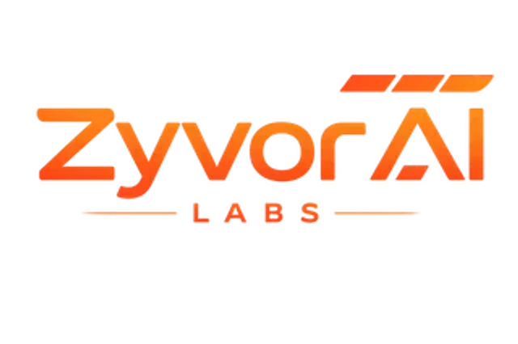

# HyperSDK Platform · Zyvor AI Labs

  

  <strong>Enterprise VM migration & VMware exit</strong> 
  96.8% first-boot success · 10 cloud providers · regulated & air-gapped programs

  
  &nbsp;
  
  &nbsp;
  

---

## ⚠️ GitHub is Community Edition only — not production support

Repos under **[github.com/hypersdk](https://github.com/hypersdk)** are **free, unsupported evaluation** code. They are useful for labs and integration tests.

**They are not a substitute for a paid migration program.** If you are running production VMs, VMware exit, 100+ machines, or need SLAs — **contact Zyvor before you rely on CE in production.**

| Free on GitHub | Paid with Zyvor (HyperSDK Platform) |
|----------------|-------------------------------------|
| No SLA | **99.9% SLA options** |
| Community Issues only | **Dedicated support & professional services** |
| Single-tool experiments | **Full 12-product pipeline + dashboard** |
| Self-service | **VMware exit playbooks, architecture reviews, cutover planning** |
| No security/compliance pack | **SOC2-ready controls, RBAC/SSO, audit logging** |

**→ [Contact sales](https://zyvor.dev/contact?utm_source=github&utm_medium=hypersdk_org)** · **[sales@zyvor.dev](mailto:sales@zyvor.dev)** · **[info@zyvor.dev](mailto:info@zyvor.dev)**

---

## Why teams pay for HyperSDK Platform

| Pain | What Zyvor delivers |
|------|---------------------|
| **VMware licensing** ($1,200–5,000/VM/yr typical) | Flat economics — [see ROI](https://zyvor.dev/roi?utm_source=github&utm_medium=hypersdk_org) |
| **Failed migrations / boot loops** | **96.8% first-boot success**, automated VirtIO & boot repair |
| **Tool sprawl** (export + convert + fix + K8s) | **One platform** — export → convert → inspect → deploy → operate |
| **Regulated / air-gapped** | Bundled disconnected migration, audit-friendly operations |

**Outcomes customers cite:** 350 VMs in 6 weeks · $1.2M annual savings · $720K cloud spend reduction — [case studies](https://zyvor.dev/case-studies?utm_source=github&utm_medium=hypersdk_org)

---

## Contact sales (start here)

| | |
|---|---|
| **Schedule a demo** | **[zyvor.dev/contact?intent=demo](https://zyvor.dev/contact?intent=demo&utm_source=github&utm_medium=hypersdk_org)** |
| **Sales** | **[sales@zyvor.dev](mailto:sales@zyvor.dev)** |
| **General** | **[info@zyvor.dev](mailto:info@zyvor.dev)** |
| **Website** | **[zyvor.dev](https://zyvor.dev/?utm_source=github&utm_medium=hypersdk_org)** |
| **VMware exit** | **[zyvor.dev/vmware-exit](https://zyvor.dev/vmware-exit?utm_source=github&utm_medium=hypersdk_org)** |
| **Pricing** | **[zyvor.dev/pricing](https://zyvor.dev/pricing?utm_source=github&utm_medium=hypersdk_org)** |

**Do not open GitHub Issues for quotes, licensing, or migration programs** — use the contact links above.

---

## Platform suite (enterprise)

One contract, one pipeline — details on **[zyvor.dev](https://zyvor.dev/docs/products?utm_source=github&utm_medium=hypersdk_org)**:

| | Product | Outcome |
|---|---------|---------|
| Export | **[HyperSDK Platform](https://zyvor.dev/hypersdk?utm_source=github&utm_medium=hypersdk_org)** | Multi-cloud export (10 providers) |
| Convert | **[hyper2kvm](https://zyvor.dev/hyper2kvm?utm_source=github&utm_medium=hypersdk_org)** | KVM conversion & boot validation |
| Inspect | **[GuestKit](https://zyvor.dev/guestkit?utm_source=github&utm_medium=hypersdk_org)** | Offline guest repair |
| Build | **[VMRogue](https://zyvor.dev/vmrogue?utm_source=github&utm_medium=hypersdk_org)** | Image pipeline |
| Deploy | **[Aether](https://zyvor.dev/aether?utm_source=github&utm_medium=hypersdk_org)** | Workload runtime |
| Manage | **[v9s](https://zyvor.dev/v9s?utm_source=github&utm_medium=hypersdk_org)** | KubeVirt fleet ops |
| Observe | **[PacketWolf](https://zyvor.dev/packetwolf?utm_source=github&utm_medium=hypersdk_org)** | Network observability |
| Compute | **[Forge](https://zyvor.dev/forge?utm_source=github&utm_medium=hypersdk_org)** · **[IronWolf](https://zyvor.dev/ironwolf?utm_source=github&utm_medium=hypersdk_org)** | GPU & bare metal |
| Cluster | **[HyperCluster](https://zyvor.dev/hypercluster?utm_source=github&utm_medium=hypersdk_org)** | Cluster operations |

Also: [Machina](https://zyvor.dev/machina?utm_source=github&utm_medium=hypersdk_org) · [Ragnarok](https://zyvor.dev/ragnarok?utm_source=github&utm_medium=hypersdk_org)

---

## Community Edition repos (evaluation)

| Repo | Use for |
|------|---------|
| [hypersdk/hypersdk](https://github.com/hypersdk/hypersdk) | Export daemon & providers — **[technical docs →](docs/DEVELOPER_GUIDE.md)** |
| [hypersdk/hyper2kvm](https://github.com/hypersdk/hyper2kvm) | Conversion engine |
| [hypersdk/guestkit](https://github.com/hypersdk/guestkit) | Guest disk tooling |

**CE vs Enterprise:** [docs/ce-vs-enterprise.md](docs/ce-vs-enterprise.md)

---

  <strong>Ready to migrate for real?</strong> 
  <a href="https://zyvor.dev/contact?intent=demo&utm_source=github&utm_medium=hypersdk_org"><strong>Schedule a demo</strong></a>
  &nbsp;·&nbsp;
  <a href="mailto:sales@zyvor.dev"><strong>sales@zyvor.dev</strong></a>

  HyperSDK Platform · Engineered by <a href="https://zyvor.dev/">Zyvor AI Labs</a>

